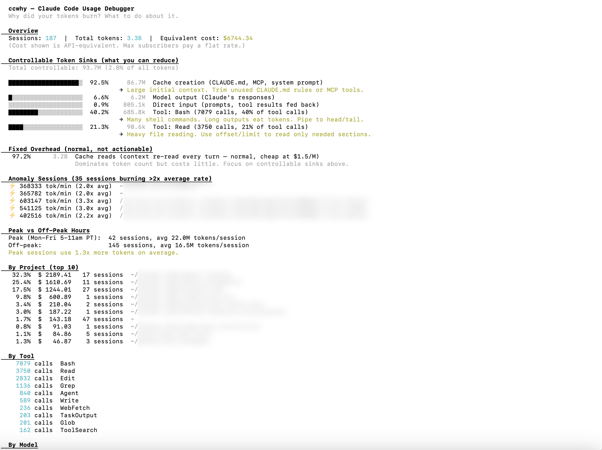
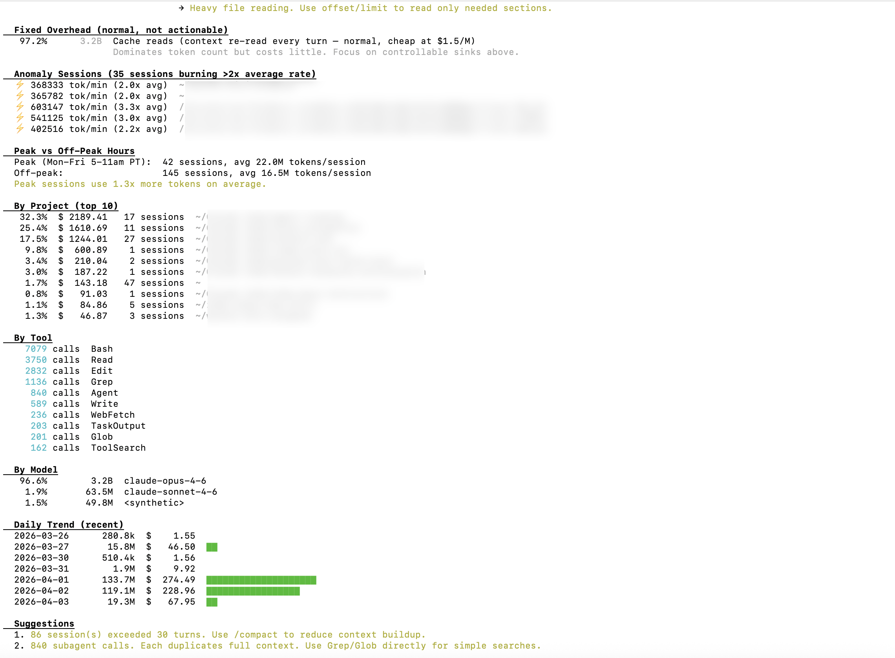

# claude-usage-analyzer

> ccusage tells you how much. claude-usage-analyzer tells you **why**, and what to do about it.

A Claude Code usage debugger written in Rust. Parses your local session data, identifies where your tokens actually went, and gives you actionable suggestions to reduce waste.

## Example Output




<details>
<summary>Text version</summary>

```
  claude-usage-analyzer — Claude Code Usage Debugger
  Why did your tokens burn? What to do about it.

  Overview
  Sessions: 187  |  Total tokens: 3.3B  |  Equivalent cost: $6,739
  (Cost shown is API-equivalent. Max subscribers pay a flat rate.)

  Controllable Token Sinks (what you can reduce)
  Total controllable: 93.7M (2.8% of all tokens)

  ███████████████████░  92.5%  86.7M  Cache creation (CLAUDE.md, MCP, system prompt)
                                → Large initial context. Trim unused CLAUDE.md rules or MCP tools.
  █░░░░░░░░░░░░░░░░░░   6.6%   6.2M  Model output (Claude's responses)
  ████████░░░░░░░░░░░░  40.2%         Tool: Bash (7,074 calls, 40% of tool calls)
                                → Many shell commands. Long outputs eat tokens. Pipe to head/tail.

  Fixed Overhead (normal, not actionable)
  97.2%  3.2B  Cache reads (context re-read every turn — normal, cheap at $1.5/M)

  Anomaly Sessions (33 sessions burning >2x average rate)
  ⚡ 710,300 tok/min (3.9x avg)  ~/Claude Code/agent-trading
  ⚡ 603,147 tok/min (3.3x avg)  /tmp/aca-sandbox

  Peak vs Off-Peak Hours
  Peak (Mon-Fri 5-11am PT):  42 sessions, avg 21.9M tokens/session
  Off-peak:                  145 sessions, avg 16.5M tokens/session
  Peak sessions use 1.3x more tokens on average.

  Suggestions
  1. 86 session(s) exceeded 30 turns. Use /compact to reduce context buildup.
  2. 840 subagent calls. Each duplicates full context. Use Grep/Glob directly.
```
</details>

## Install

### Homebrew (macOS)

```bash
brew install SingggggYee/tap/ccwhy
```

### Cargo (any platform with Rust)

```bash
cargo install ccwhy
```

### Download binary (no Rust needed)

Grab the latest release from [Releases](https://github.com/SingggggYee/claude-usage-analyzer/releases):

```bash
# macOS Apple Silicon
curl -L https://github.com/SingggggYee/claude-usage-analyzer/releases/latest/download/claude-usage-analyzer-macos-aarch64.tar.gz | tar xz
./ccwhy

# macOS Intel
curl -L https://github.com/SingggggYee/claude-usage-analyzer/releases/latest/download/claude-usage-analyzer-macos-x86_64.tar.gz | tar xz

# Linux x86_64
curl -L https://github.com/SingggggYee/claude-usage-analyzer/releases/latest/download/claude-usage-analyzer-linux-x86_64.tar.gz | tar xz
```

### Build from source

```bash
git clone https://github.com/SingggggYee/claude-usage-analyzer
cd claude-usage-analyzer
cargo build --release
./target/release/ccwhy
```

### Claude Code Skill (via ClawHub)

Also available as a Claude Code skill: [Claude Usage Analyzer on ClawHub](https://clawhub.ai/singggggyee/claude-usage-analyzer)

## Usage

```bash
# Full report (last 30 days)
ccwhy

# Last 7 days
ccwhy report --days 7

# All time
ccwhy report --days 0

# Top sessions by cost
ccwhy sessions

# Session detail
ccwhy session <session-id-prefix>
```

## What It Tells You

### Top Token Sinks
Where your tokens actually go. Not just totals — broken down by:
- Cache reads vs cache creation vs output
- Tool usage (Bash, Read, Edit, Agent, etc.)
- Per-tool call counts and estimated token impact

### By Project
Which project is burning the most tokens. Sort by cost, see session counts.

### By Tool
How many times each tool was called. Highlights if Read or Bash dominates (common waste pattern).

### By Model
Token split between Opus, Sonnet, Haiku.

### Daily Trend
Visual bar chart of daily consumption.

### Actionable Suggestions
Based on your actual usage patterns:
- "86 sessions exceeded 30 turns — use /compact"
- "Read tool is 40% of calls — use Grep to find specific content"
- "840 subagent calls — each duplicates full context"
- "Write calls outnumber Edit 2:1 — Edit sends only the diff"

## How Is This Different from ccusage?

| | ccusage | claude-usage-analyzer |
|---|---------|-------|
| **Question** | "How much did I spend?" | "Why did I spend it? How do I spend less?" |
| **Output** | Token counts, cost tables | Token sinks, tool attribution, optimization suggestions |
| **Accuracy** | Known dedup issues (#313, #455) | Last-write-wins dedup on (requestId, uuid) |
| **Performance** | Node.js, can timeout on large data | Rust, streaming parser |
| **Scope** | Observability | Optimization |

claude-usage-analyzer is not a replacement for ccusage. Use ccusage for daily/monthly cost tracking. Use claude-usage-analyzer to understand **why** and **what to change**.

## How It Works

1. Reads all `~/.claude/projects/*/*.jsonl` session files
2. Deduplicates usage entries using last-write-wins on (requestId, uuid)
3. Aggregates by project, tool, model, and day
4. Identifies top token sinks with percentage breakdown
5. Generates suggestions based on usage patterns

No network access. No API keys. Everything runs locally on your session data.

## Also: cclint

claude-usage-analyzer shows you where tokens went. **[cclint](https://github.com/SingggggYee/cclint)** shows you what to fix in your config.

```bash
cargo install cclint && cclint
```

It lints your CLAUDE.md, hooks, skills, and commands for token waste. Gives you a health score and specific fixes.

## Requirements

- Rust 1.75+ (for building)
- Claude Code session data in `~/.claude/projects/`

## License

MIT
